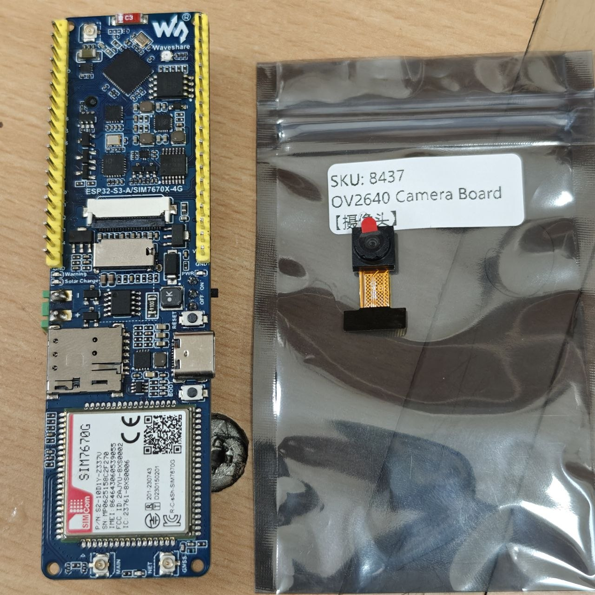
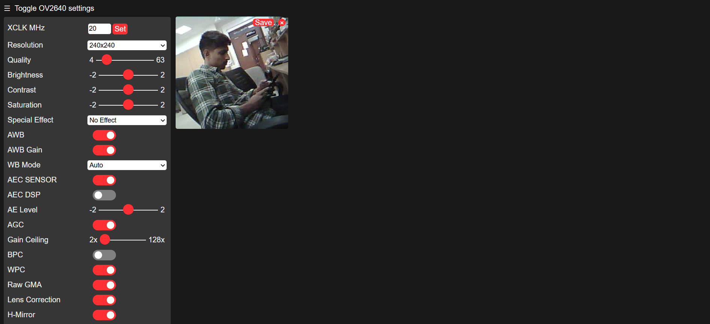
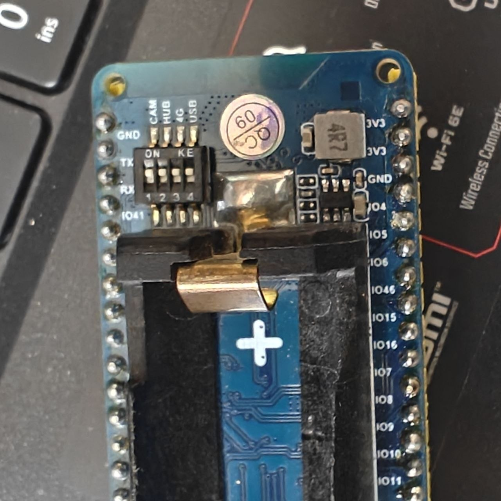

# ESP32-S3 SIM7670X 4G + OV2640 Camera Web Server

A working Arduino camera web server for the **Waveshare ESP32-S3-A/SIM7670X-4G** development board with an **OV2640** camera. The project adds the board-specific camera pin map to Espressif's CameraWebServer example and serves a live MJPEG stream plus camera controls over Wi-Fi.

> This repository currently covers the ESP32-S3 camera and Wi-Fi path. It does not yet use the board's SIM7670X 4G modem.



## Demonstrated result

The sketch has been run on the pictured hardware and the OV2640 control page and live preview were verified.



<details>
<summary>Rear power and switch detail</summary>



</details>

## Hardware

- Waveshare ESP32-S3-A/SIM7670X-4G board
- OV2640 camera module with 24-pin FPC connection
- USB-C data cable
- 2.4 GHz Wi-Fi network

The Waveshare board also contains a cellular modem, microSD slot, battery support, and solar charging input, but those features are outside this example.

## Camera pin map

The custom `CAMERA_MODEL_WAVESHARE_SIM7670X` configuration is in `CameraWebServer/camera_pins.h`.

| Signal | ESP32-S3 GPIO |
| --- | ---: |
| XCLK | 34 |
| SIOD / SDA | 15 |
| SIOC / SCL | 16 |
| Y2–Y9 | 7, 8, 9, 10, 11, 12, 13, 14 |
| VSYNC | 36 |
| HREF | 35 |
| PCLK | 37 |
| PWDN | Not connected (`-1`) |
| RESET | Not connected (`-1`) |

## Arduino IDE setup

1. Install Arduino IDE 2.x.
2. Add Espressif's ESP32 board package and select **ESP32S3 Dev Module**.
3. Use these board options:
   - PSRAM: **OPI PSRAM** (or the PSRAM option appropriate for your board revision)
   - Flash mode: **QIO**
   - Partition scheme: a layout with at least **3 MB application space**; the included `partitions.csv` provides a custom layout
4. Copy `CameraWebServer/secrets.example.h` to `CameraWebServer/secrets.h`.
5. Put your 2.4 GHz Wi-Fi name and password in `secrets.h`.
6. Open `CameraWebServer/CameraWebServer.ino`, compile, and upload.
7. Open Serial Monitor at **115200 baud** and reset the board.
8. Open the printed `http://...` address in a browser on the same network.

The sketch stops retrying after 30 seconds when Wi-Fi cannot be reached, so a bad credential does not leave setup blocked forever.

## Board switches and camera connection

- Disconnect power before inserting or removing the camera ribbon.
- Make sure the ribbon is fully seated and the connector latch is closed.
- Set the board's camera-related DIP switch/power routing according to the labels and the Waveshare manual for your exact board revision.
- The board photo in this repository may not match every V1/V2 switch layout; verify against the official documentation before applying power.

## Security notes

- `secrets.h` is excluded by `.gitignore`; never commit real Wi-Fi credentials.
- The camera web page uses plain HTTP and has no authentication.
- Use it only on a trusted local network. Do not expose it directly to the public internet or forward its port from your router.
- If credentials have ever appeared in a public commit, rotate them even after deleting the file because Git history retains old content.

## Troubleshooting

### Camera initialization fails

- Confirm `CAMERA_MODEL_WAVESHARE_SIM7670X` is selected in `board_config.h`.
- Reseat the camera ribbon and check its orientation.
- Enable PSRAM and use a partition with at least 3 MB application space.
- Confirm the camera is an OV2640-compatible module.

### Wi-Fi never connects

- ESP32-S3 Wi-Fi is 2.4 GHz; check that the access point exposes a compatible network.
- Verify `secrets.h` and watch Serial Monitor for the 30-second timeout message.
- Keep the board and computer on the same network when opening the local IP address.

### Serial Monitor is blank

- Set the monitor to 115200 baud and press reset.
- If needed, upload `examples/serial_smoke_test/serial_smoke_test.ino` first to verify the USB/serial path.

## Project layout

```text
CameraWebServer/              Camera sketch and web UI
  CameraWebServer.ino
  board_config.h              Selected Waveshare board target
  camera_pins.h               Board-specific camera GPIO mapping
  secrets.example.h           Safe credentials template
  partitions.csv              Custom flash partition layout
docs/images/                  Hardware and working-demo photos
examples/serial_smoke_test/   Minimal USB/serial check
```

## Upstream and license

This project is based on Espressif's [Arduino ESP32 CameraWebServer example](https://github.com/espressif/arduino-esp32/tree/master/libraries/ESP32/examples/Camera/CameraWebServer), with a Waveshare-specific camera definition and local setup changes. Espressif's relevant source files are licensed under the Apache License 2.0. This repository is distributed under the same license; see [LICENSE](LICENSE).

Useful hardware reference: [Waveshare ESP32-S3-A/SIM7670X-4G HAT wiki](https://www.waveshare.com/wiki/ESP32-S3-A-SIM7670X-4G_HAT).
